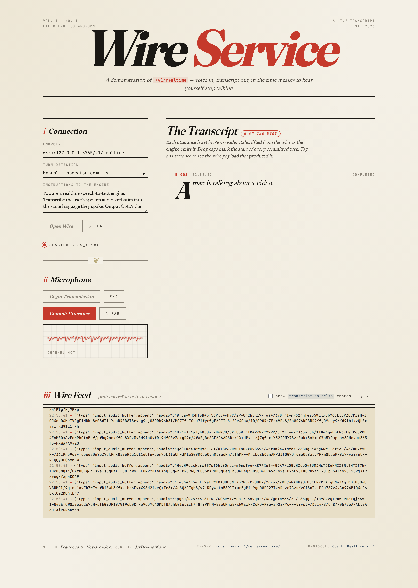

# Wire Service — /v1/realtime web demo



Editorial-broadsheet single-page client for `/v1/realtime`. Captures
the microphone, streams PCM16 chunks to the WebSocket, and renders each
turn as an editorial card: the assistant's reply (drop caps, vermilion
in-progress rule) appears first, then the verbatim transcript of what
you said fills in below. Vanilla HTML/CSS/JS — no build step.

## Run

1. **Start the server** (with the realtime endpoint enabled):

   ```bash
   sgl-omni serve \
     --model-path Qwen/Qwen3-Omni-30B-A3B-Instruct \
     --text-only \
     --port 8765 \
     --enable-realtime
   ```

2. **Serve this directory** over HTTP (browsers won't grant
   `getUserMedia` to `file://`):

   ```bash
   cd playground/web/realtime
   python -m http.server 8080
   ```

3. **Open** <http://127.0.0.1:8080> in a modern browser. Click
   **Open Wire**, then **Begin Transmission**, and start speaking.
   Server VAD detects when you stop; the engine replies, then
   transcribes your speech to fill conversation history.

## What you'll see

| UI panel | Meaning |
|---|---|
| **Endpoint** | WebSocket endpoint to connect to. |
| **Instructions** | System prompt sent in `session.update`. Affects the assistant reply only — transcription always runs verbatim. |
| **Transcripts** | Each VAD-driven turn appears as a card. The assistant reply streams in first (from `response.text.delta`), then the user transcript fills in below (from `conversation.item.input_audio_transcription.delta`). |

## Notes

- VAD is always on server-side; there's no manual commit. Just speak,
  pause, and the server picks up the turn.
- The page constructs its own `AudioWorklet` inline so there's no build
  step / package.json required.
- Audio is captured at 16 kHz, converted to PCM16 little-endian, and
  base64-encoded into `input_audio_buffer.append` frames.
- The page does no error handling beyond updating the status line —
  matching the project's house style. If the WS drops mid-session,
  reconnect.
